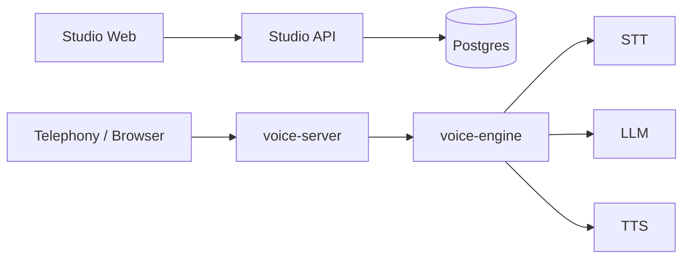

<p align="center">
  <picture>
    <source media="(prefers-color-scheme: dark)" srcset="https://github.com/user-attachments/assets/44900cfc-85f0-4013-8d9c-041b108aeb59">
    
  </picture>
</p>

[](https://feros.ai)
[](LICENSE)
[](http://discord.com/invite/yjfk7KuXgq)

**Feros Voice Agent OS** is built with a clear goal: providing an **open**, **airtight**, and **enterprise-grade** infrastructure layer for production voice AI.

We built Feros to solve the structural problems of the current voice AI ecosystem. With a Rust runtime engineered for sub-second latency, an AI-driven builder, and a Python control plane—**all in a single self-hostable monorepo**—we address these barriers head-on:

| The Approach                                     | The Barrier                                                                                                  | The Feros Solution                                                                                                              |
| :----------------------------------------------- | :----------------------------------------------------------------------------------------------------------- | :------------------------------------------------------------------------------------------------------------------------------ |
| **Managed Platforms**<br>_(Vapi, Retell)_        | Per-minute costs compound at scale, with no path to self-host or satisfy strict data residency requirements. | Deploy the complete platform in your own infrastructure — no per-minute taxes, full control over data residency and compliance. |
| **Low-Level Frameworks**<br>_(Pipecat, LiveKit)_ | Weeks spent building and maintaining the voice pipeline, rather than focusing on agent quality.              | A production-ready voice pipeline — VAD, STT, LLM, TTS — ships on day one. Focus on the agent, not the plumbing.                |
| **Visual Node Builders**<br>_(Legacy platforms)_ | Hand-wiring agent logic, dragging nodes, and stitching call flows step-by-step becomes unmaintainable.       | Describe what you want your agent to do, and the AI autonomously provisions the tools, prompts, and routing logic.              |

<video src="https://github.com/user-attachments/assets/90964717-fec1-4218-a687-29e7967c52ec" autoplay loop muted playsinline style="max-width:100%; border-radius: 8px; box-shadow: 0 4px 24px rgba(0,0,0,0.1);"></video>

## Architecture

The control plane (Python) handles configuration and management. The voice runtime (Rust) handles every live call. The two layers scale independently, and every component — STT, LLM, TTS, telephony provider — is swappable without touching the rest.



| Layer                | Component    | Purpose                                                                                                                 |
| :------------------- | :----------- | :---------------------------------------------------------------------------------------------------------------------- |
| Dashboard            | studio/web   | Agent builder, call monitoring, in-browser voice testing                                                                |
| Control Plane        | studio/api   | Agent config, integrations, evaluations, session provisioning                                                           |
| Integrations         | integrations | Encrypted credential vault for CRMs, calendars, etc. — third-party secrets never leave your infrastructure in plaintext |
| Voice Runtime        | voice/server | Inbound telephony and WebSocket gateway                                                                                 |
|                      | voice/engine | High-performance VAD → STT → LLM → TTS orchestration                                                                    |
| Inference (optional) | inference    | Self-hosted GPU STT/TTS — drop-in for cloud APIs                                                                        |

## Repository Structure

> All services live in a single repo and share a common Postgres database and config layer.

| Path           | Purpose                                                                        |
| :------------- | :----------------------------------------------------------------------------- |
| `studio/web`   | Next.js dashboard and AI-driven agent builder                                  |
| `studio/api`   | FastAPI control plane — agent config, integrations, evaluations, session setup |
| `voice/server` | Rust telephony gateway and session router                                      |
| `voice/engine` | Rust runtime core — streaming STT/LLM/TTS orchestration at sub-second latency  |
| `integrations` | Credential encryption, secret resolution, and automatic token refresh          |
| `inference`    | Optional self-hosted STT/TTS stack for cost control and data sovereignty       |
| `proto`        | Shared protobuf definitions for WebSocket message payloads                     |

## Quickstart

**Requirements:** Docker and Docker Compose.

```bash
git clone https://github.com/ferosai/feros.git
cd feros
cp .env.example .env

# Run with prebuilt multi-arch images (Lightning fast startup)
docker compose up -d

# OR, if you need to build the Rust/Python core from source:
# docker compose -f docker-compose.yml -f docker-compose.source.yml up -d --build
```

Open `http://localhost:3000` to access the dashboard.

**Local services:**

| Service      | URL                     |
| :----------- | :---------------------- |
| Studio Web   | `http://localhost:3000` |
| Studio API   | `http://localhost:8000` |
| Voice Server | `http://localhost:8300` |

`AUTH__SECRET_KEY` and `DATABASE__URL` must be set consistently across all services in your `.env`.

The minimum runtime configuration is 2 CPU cores and 2 GB of RAM. Hosting the web app on Vercel or Cloudflare can reduce the resource requirements of the main runtime. For heavier workloads, we recommend 4 CPU cores and 8 GB of RAM.

## Roadmap

- [ ] Outbound calls — agent-initiated dialing with retry and scheduling
- [ ] Dynamic Agent Variables — resolve runtime context at session start for personalized conversations
- [ ] Granular Usage Billing — step-level cost attribution across models and third-party services
- [ ] Gemini Live native audio — end-to-end multimodal backend
- [ ] Direct PSTN via SIP — no Twilio or Telnyx required
- [ ] Agent-to-agent evaluation — tester agent calling target agent over live audio
- [ ] Evaluation replay — run historical transcripts against new agent versions
- [ ] Audit logs — immutable trail of agent actions and config changes
- [ ] Usage analytics — per-agent cost tracking across STT, LLM, and TTS providers

## Contributing

Contributions are welcome. Before starting larger changes, please open an issue or discussion first — alignment before implementation saves time.

- Familiarize yourself with the voice runtime architecture before making changes to the Rust core; it has strict ordering and concurrency constraints.
- Run the affected service locally before opening a PR.
- Add or update tests when behavior changes; the voice pipeline has integration tests that catch regressions the unit tests miss.

## License

Apache License 2.0. See [LICENSE](LICENSE) for details.

Third-party code vendored in this repository remains subject to its own license terms where noted in the source tree.
