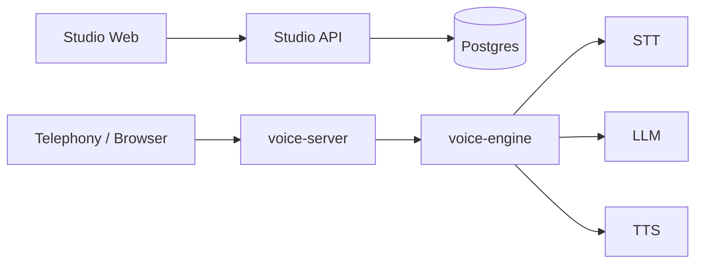

# Feros

**Feros Voice Agent OS** is built with a clear goal: providing an **open**, **airtight**, and **enterprise-grade** infrastructure layer for production voice AI.

We built Feros to solve the structural problems of the current voice AI ecosystem. With a Rust runtime engineered for sub-second latency, an AI-driven builder, and a Python control plane—**all in a single self-hostable monorepo**—we address these barriers head-on:

| The Approach | The Barrier | The Feros Solution |
| :--- | :--- | :--- |
| **Managed Platforms**<br>*(Vapi, Retell)* | **The "Second Mile" barrier:** Strict data residency requirements, and per-minute costs that compound at scale. | **Full Stack Ownership:** Deploy the complete platform in your own infrastructure. Eliminate per-minute API taxes and keep full control over data residency and compliance. |
| **Low-Level Frameworks**<br>*(Pipecat, LiveKit)* | **The "Plumbing" trap:** Wasting weeks pulling off the voice pipeline rather than focusing on building and testing agent qualities. | **Production-Ready Runtime:** A sub-second core engine handles transport, STT, and TTS orchestration out-of-the-box. |
| **Visual Node Builders**<br>*(Legacy platforms)* | **The "Spaghetti" trap:** Hand-wiring agent logic, dragging nodes, and stitching call flows step-by-step becomes unmaintainable. | **AI-Driven Agent Building:** Describe what you want your agent to accomplish, and the AI autonomously provisions the tools, prompts, and routing logic for you. |

## Why Feros

Hosted platforms own your pipeline. Legacy builders make you own the wiring. Feros does neither.

- **Zero lock-in architecture** — Maintain absolute control over the entire voice stack. Effortlessly swap between cloud APIs or self-hosted models for STT, LLM, and TTS, and bring your own telephony provider to completely bypass platform lock-in.
- **Built to scale without compromise** — The Rust-based voice runtime is engineered for resource efficiency, so scaling your deployment costs significantly less than Python-based runtimes. The same workload runs on meaningfully less infrastructure.
- **AI-driven agent building** — Describe your intent in plain language. Feros autonomously provisions the entire agent: generating prompts, tool definitions, routing logic, and escalation rules. No node editors, no manual flow stitching.
- **Native SaaS integrations** — Connect directly to CRMs, calendars, and external databases out-of-the-box. Your agents can securely read, write, and take actions across your existing tech stack.

## Demo

<video src="https://github.com/user-attachments/assets/aec117bf-e85d-4e6f-be14-95666a44addc" autoplay loop muted playsinline style="max-width:100%; border-radius: 8px; box-shadow: 0 4px 24px rgba(0,0,0,0.1);"></video>


## How It Works

Feros has a deliberate split between a **Python control plane** for agent configuration and management, and a **Rust runtime** that handles every live call. The two layers scale independently, and you can swap any component — STT, LLM, TTS, telephony provider — without touching the rest.



| Layer | Component | What it does |
| :--- | :--- | :--- |
| **Dashboard** | Studio Web | AI-driven agent builder, call monitoring, phone numbers, and in-browser voice testing |
| **Control Plane** | Studio API | Agent definitions, integration secrets, evaluation pipelines, and session provisioning |
| | Integrations | Encrypted credential vault — third-party secrets never leave your infrastructure in plaintext |
| **Voice Runtime** | Voice Server | Inbound telephony and WebSocket gateway — provisions sessions and routes live calls to the engine |
| | Voice Engine | The performance core — orchestrates the full VAD → STT → LLM → TTS pipeline at sub-second latency |
| **Inference** *(optional)* | Inference Stack | Self-hosted, GPU-accelerated STT and TTS — drop-in replacements for cloud APIs to cut costs and satisfy data residency requirements |

## Monorepo Structure

> For contributors and developers. All services live in a single repo and share a common Postgres database and config layer.

| Path | Purpose |
|---|---|
| `studio/web` | Next.js dashboard and AI-driven builder UI |
| `studio/api` | FastAPI control plane — config, APIs, integrations, evaluations, session setup |
| `voice/server` | Rust telephony gateway and session router |
| `voice/engine` | Rust runtime core — streaming STT/LLM/TTS orchestration at sub-second latency |
| `integrations` | Credential encryption, secret resolution, and automatic token refresh |
| `inference` | Optional self-hosted STT/TTS stack for cost control and data sovereignty |
| `proto` | Shared protobuf definitions for WebSocket message payloads |

## Quickstart

One command brings up the full platform locally.

### 1. Start the stack

```bash
docker compose up -d
```

This brings up:

- `db` (Postgres)
- `studio-api` on `http://localhost:8000`
- `voice-server` on `http://localhost:8300`
- `studio-web` on `http://localhost:3000`

> **Note:** Both `studio-api` and `voice-server` share `AUTH__SECRET_KEY` and `DATABASE__URL` — make sure these are set consistently in your `.env`.

### 2. Verify health

```bash
curl http://localhost:8000/api/health
docker compose ps
```

### 3. Open the app

Go to `http://localhost:3000`.

### 4. Stop the stack

```bash
docker compose down
```

## Roadmap

- [ ] **Gemini Live native audio** — end-to-end native multimodal backend for ultra-low-latency audio-to-audio models
- [ ] **Outbound calls** — agent-initiated outbound dialing with programmable call scheduling and retry logic
- [ ] **Agent-to-agent audio testing** — spin up a dedicated tester agent that calls the target agent over a live audio channel and evaluates responses end-to-end, covering the full voice pipeline without mocks
- [ ] **Audit logs** — immutable, tamper-evident log trail of all agent actions, credential access, and configuration changes for compliance and security review
- [ ] **Direct PSTN via SIP** — direct PSTN connectivity via any SIP provider without a telephony middleware layer; no Twilio or Telnyx required
- [ ] **Evaluation replay** — re-run historical call transcripts against new agent versions to catch regressions
- [ ] **Usage-based analytics** — per-agent cost tracking across STT, LLM, and TTS providers
- [ ] **Deployment templates** — one-click Kubernetes manifests and Terraform modules for cloud-native production deployments

## Contributing

- The voice runtime has strict ordering and concurrency constraints — familiarize yourself with the architecture before making larger changes.
- Always run the service you're changing locally to verify actual behavior before opening a PR.
- Add or update tests when behavior changes; the voice pipeline has integration tests that catch regressions the unit tests miss.
- Open an issue or discussion first for architectural changes — alignment before implementation saves everyone time.

## License

This repository is released under the Apache License 2.0. See the root [`LICENSE`](LICENSE) file for details.

Third-party code vendored in this repository remains subject to its own license terms where noted in the source tree.
