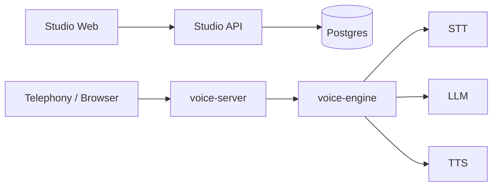

# Feros

**Open-source Voice Agent OS** — the self-hostable infrastructure layer for production voice AI.

Vapi and Retell solved the first mile. Production voice AI has a second: latency that degrades under load, compliance that demands data residency, lock-in that becomes technical debt, and per-minute costs that compound at scale.

Most platforms still make you hand-wire agent logic — drag nodes, chain prompts, stitch call flows step by step. Feros is different: describe what your agent should do, and the AI builds the configuration for you. A Rust runtime engineered for sub-200ms latency, an AI-driven builder, and a Python control plane, all in a single self-hostable monorepo.

## Why Feros

Hosted platforms own your pipeline. Legacy builders make you own the wiring. Feros does neither.

- **AI-driven configuration** — Describe intent in plain language. Feros generates the full agent config: prompts, tools, routing logic, and escalation rules. No node editors, no manual flow stitching.
- **Rust voice runtime** — Single async reactor loop across VAD → STT → LLM → TTS. No Python GIL, no inter-process overhead. Latency is architecture, not luck.
- **Sub-200ms by design** — Streaming STT, token-streaming LLM, and chunked TTS synthesis are co-designed so audio starts flowing before generation completes.
- **Any provider, zero lock-in** — Every STT, LLM, and TTS slot accepts any OpenAI-compatible endpoint. Swap cloud APIs for self-hosted models with a config change.
- **Full stack ownership** — `docker compose up` deploys the entire platform. Your infra, your data, your costs.
- **Bring your own telephony** — Use any phone number provider you already work with. No forced vendor, no platform surcharge on every call.
- **GPU inference stack** — Optional self-hosted speech services eliminate per-minute API costs at volume and satisfy strict data residency requirements.

## Demo

![Voice Agent OS demo]

## Platform Overview

Feros ships as a complete, production-grade voice AI platform — every layer from builder to runtime to optional self-hosted inference, in a single monorepo you fully own.

**Builder & Dashboard**
- **AI-driven agent builder** — describe intent in plain language; Feros generates the complete agent configuration including prompts, tool definitions, routing logic, and escalation rules. No node editors, no manual flow stitching.
- **Unified control dashboard** — manage agents, live calls, phone numbers, third-party integrations, and run in-browser voice tests from a single UI.

**Control Plane**
- **`studio-api`** — FastAPI service powering all control-plane operations: agent configuration, builder flows, integration management, session provisioning, and evaluation pipelines.
- **`integrations`** — Vault-style credential layer with envelope encryption, secret resolution, and automatic token refresh. Third-party credentials never leave your infrastructure in plaintext.

**Voice Runtime**
- **`voice-server`** — Rust gateway that handles inbound telephony and browser WebSocket sessions, authenticates callers, and routes live sessions to the engine.
- **`voice-engine`** — The low-latency core. A single async Rust reactor loop orchestrates VAD → STT → LLM → TTS with no Python GIL overhead and no inter-process round-trips. Streaming STT, token-streaming LLM, and chunked TTS synthesis are co-designed so audio starts flowing before generation completes.

**Self-Hosted Inference (Optional)**
- **`inference` stack** — GPU-accelerated STT and TTS services that expose OpenAI-compatible endpoints. Swap any cloud API for a self-hosted model with a single config change — no code modifications required. Eliminates per-minute API costs at volume and satisfies strict data residency requirements.

## Architecture At A Glance



Feros makes a deliberate architectural separation between the **Python control plane** and the **Rust runtime plane**:

- **`studio-web`** — Next.js dashboard and AI-driven builder UX. Configuration lives here; nothing latency-critical.
- **`studio-api`** — FastAPI control plane. Owns agent config, integration secrets, evaluation pipelines, and session setup. Scales independently of the voice runtime.
- **`voice-server`** — Rust gateway. Terminates telephony and browser WebSocket connections, authenticates sessions, and routes to the engine without touching Python.
- **`voice-engine`** — The performance-critical core. A single `tokio::select!` reactor loop eliminates thread-boundary overhead. Every pipeline stage — denoising, VAD, STT, LLM, TTS, smart turn detection — runs in the same async context. Latency is an architectural property, not a tuning exercise.

The clean boundary means you can scale the runtime layer independently, replace individual STT/LLM/TTS providers without touching the control plane, and audit or self-host exactly the components your compliance requirements demand.

## Monorepo Structure

| Path | Purpose |
|---|---|
| `studio/web` | Next.js dashboard and AI-driven builder UI |
| `studio/api` | FastAPI control plane — config, APIs, integrations, evaluations, session setup |
| `voice/server` | Rust telephony gateway and session router |
| `voice/engine` | Rust runtime core — streaming STT/LLM/TTS orchestration at sub-200ms |
| `integrations` | Credential encryption, secret resolution, and automatic token refresh |
| `inference` | Optional self-hosted STT/TTS stack for cost control and data sovereignty |
| `proto` | Shared protobuf definitions for WebSocket message payloads |

## Quickstart

One command brings up the full production stack locally.

### 1. Start the core stack

```bash
docker compose up -d
```

This brings up:

- `db` (Postgres)
- `studio-api` on `http://localhost:8000`
- `voice-server` on `http://localhost:8300`
- `studio-web` on `http://localhost:3000`

### 2. Verify health

```bash
curl http://localhost:8000/api/health
docker compose ps
```

### 3. Open the app

Go to `http://localhost:3000`.

### 4. Keep shared config aligned

`studio-api` and `voice-server` both read `AUTH__SECRET_KEY` and `DATABASE__URL`.

### 5. Stop the stack

```bash
docker compose down
```

## Local Development

The root `docker compose up -d` flow is the recommended way to run the full platform locally. For iterating on individual components — the Rust engine, the FastAPI control plane, or the Next.js frontend — component-level development workflows and hot-reload configurations are documented in the per-service READMEs and the main docs.

## Contributing

- Read the architecture docs before making larger changes — the Rust reactor design has non-obvious constraints.
- Run the service you are changing locally rather than reasoning about behavior from code alone.
- Add or update tests when behavior changes; the voice pipeline has integration tests that catch regressions the unit tests miss.
- Open an issue or discussion to align on architectural changes before implementing them.

## Project Status

Feros is under active development on a production trajectory. The core runtime architecture — Rust reactor, streaming pipeline, control/runtime plane separation — is stable. APIs, builder workflows, and documentation continue to expand as the platform matures.

## License

This repository is released under the Apache License 2.0. See the root [`LICENSE`](LICENSE) file for details.

Third-party code vendored in this repository remains subject to its own license terms where noted in the source tree.
